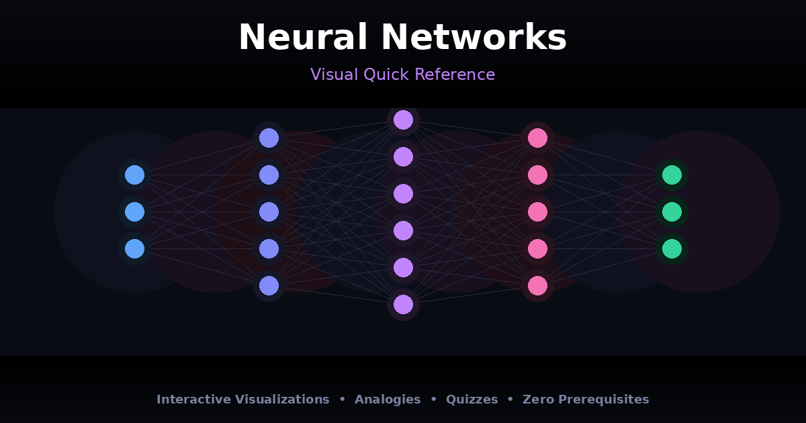

# Neural Networks — Visual Quick Reference

An interactive, single-page visual guide to understanding neural networks from scratch. No prerequisites needed.

**[View Live Demo →](https://dharmendra-verma.github.io/neural-network-explainer/)**



## What's Inside

- **Intuitive Analogies** — Neural networks explained through everyday concepts like kitchens, orchestras, and factory assembly lines
- **Live Network Visualization** — Interactive canvas animation showing how data flows through neurons in real-time
- **Step-by-Step Math** — Forward propagation, backpropagation, and gradient descent broken down with formulas and memory tips
- **Activation Functions** — Visual graphs of Sigmoid, ReLU, Tanh, Softmax, and Leaky ReLU with use-case guidance
- **Network Types** — CNN, RNN, Transformer, GAN, and Autoencoder explained with real-world applications
- **Interactive Quiz** — Test your understanding with 10 questions and detailed explanations
- **Cheat Sheet** — Quick-reference cards for hyperparameters, common pitfalls, and a learning roadmap

## Tech

Zero dependencies. One self-contained HTML file with vanilla JavaScript and CSS — no build step, no frameworks. Just open `index.html` in a browser.

## Usage

```bash
# Clone and open
git clone https://github.com/dharmendra-verma/neural-network-explainer.git
cd neural-network-explainer
open index.html    # macOS
# or
xdg-open index.html  # Linux
```

Or just visit the [live site](https://dharmendra-verma.github.io/neural-network-explainer/).

## Contributing

Found a typo or want to add a section? PRs welcome.

## License

MIT License — free to use, share, and modify.
